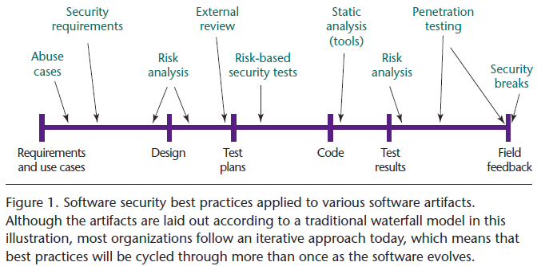

# Software Security

This repository contains all assignments for the course "Software Security" (NWI-ISOFSE) given at the Radboud University.
See: https://www.cs.ru.nl/E.Poll/ss/

## Course overview

* Lecture 1 - Introduction & Security in the SDLC (Security Development Life Cyle?)
* Lecture 2 - Buffer overflows & platform-level countermeasures
* Lecture 3 - Other countermeasures and Static Analysis with PREfast & SAL
* Lecture 4 - Input problems
* Lecture 5 - Discussion PREfast project, Intro group project
* Lecture 6 - 'Safe' programming languages
* Lecture 7 - Sandboxing
* Lecture 8 - Java secure programming guidelines, TOCTOU attacks
* Lecture 9 - Program Verification
* Lecture 10 - Information Flow
* Lecture 11 - Information Flow for Android Apps
* Lecture 12 - Fuzzing
* Lecture 13 - LangSec & State Machine Inference
* Lecture 14 - Discussion group project
* Lecture 15 - PCC

## Lecture 1

* 