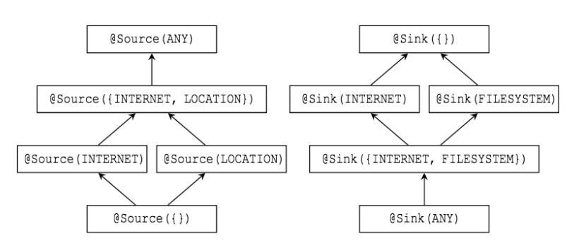

# Software Security - Exam Preparation

## Checklist for Exam

* Buffer overflows
	* Spot a simple buffer overflow. Explain how buffer overflows work, and explain some cause for them.

	* Explain/discuss any of the countermeasures against buffer overflows, (**canaries, non-executable data segments, ASLR, CFI, execution-aware memory protection**),
	  incl. static analysis of SAL-annoted code with
	  PREfast and sample coding guidelines for C(++) on constructs to
	  avoid.  (BUT NOT pointer encryption, as that technique was not 
	  treated this year)

	* Have another look at the PREfast exercise.

	* For simple pieces of code like this you should be able to explain
	  how they could be annotated with SAL and what kind of flaws PREfast
	  might then be able to detect. (You're not expected to be able to
	  produce syntactically correct SAL annotations; you just have to 
	  explain the essence of what annotations would say).

* Similar for other security flaws: Explain what 

	* **format string attack**,
	* **integer overflow**
	* **command injection**
	* **PHP injection**
	* **SQL injection (normal, blind or 2nd order )**
	* **XSS**
	* **CSRF**
	* **TOCTOU aka race conditions**
	* more generally: (lack of) input validation, output validation 
      is; spot/explain them in simple examples; explain/discuss 
      the countermeasures against them.

* Explain the notion of **TCB (Trusted Computing Base)** or 
  say what the TCB is in a given scenario.

* Comment on (some aspects of using) the **ASVS**.

* Language-based Security

	* Explain/discuss/motivate the security guarantees a "safe" language like
      Java or C# can make, such as
	* memory safety
	* type safety
	* code-based access control/sandboxing
      using typing, byte-code verification, visibility, stack walking, etc.

	* Explain how/why these guarantees can be useful.  

	* For a piece of Java code that code-based access control, say whether 
	  the stackwalking algorithm will throw exceptions due to missing
	  permissions or not for the stacks that this code produces, and 
	  be able to motivate why.

	* Explain the notions of memory-safety, type-safety, stackwalking.  

	* Explain/motivate some of the coding guidelines for Java.  

	* Explain some example problems in Java security discussed in lecture
	  slides.

	* Explain why immutability of data can be important for security.

* Explain/compare/discuss possibilities, limitations, pros and cons
  of any of the techniques treated in the course (various forms of typing,
  coding guidelines, static analysis, program verification, etc.) or 
  of any of the tools we used in the projects (PREfast, RIPS, ESC/Java.)
  Say something intelligent about the use of such tools.

* Information Flow

	* Explain what information flow is, formally or informally, what
	  without implicit and explicit flows are, what termination-senstivity is.

	* Spot information flow problems in simple examples.

	* Explain/motivate/give some of the typing rules for information flow,
	  for termination/timing-sensitive or insensitive versions.

	* Explain/motivate/give the formal definition of non-interference,
	  for termination/timing-sensitive or insenstive versions.

	* NB I expect you to be able to produce the definition of non-interference
	  and to come up with typing rules for information flows as discussed
	  in the lecture notes. (Once you understand the ideas behind the definition
	  and these rules you should be able to reproduce them.)

	* Explain/comment on the way that static analysis tools like RIPS
	  and PREfast do information flow for unvalidated inputs (aka
	  tainting).

	* Explain/motivate the idea behind the SPARTA system & approach, how
	  it works, what the limitations are, and how the approach copes with
	  implicit flows. Explain which parts of the SPARTA validation scheme
	  are manual and which are automated.

* Security Testing and Fuzzing

	* Explain what a **test oracle** is, what fuzzing is & how it works.
		* A test oracle is a source of information about whether the output of a program (or function or method) is correct or not.
		* A test oracle might specify correct output for all possible input or only for specific input. It might not specify actual output values but only constraints on them. The oracle might be:
			* a program (separate from the system under test) which takes the same input and produces the same output
			* documentation that gives specific correct outputs for specific given inputs
			* a documented algorithm that a human could use to calculate correct outputs for given inputs
			* a human domain expert who can somehow look at the output and tell whether it is correct
			* or any other way of telling that output is correct.
		* Fuzzing or fuzz testing is an automated software testing technique that involves providing invalid, unexpected, or random data as inputs to a computer program. The program is then monitored for exceptions such as crashes, or failing built-in code assertions or for finding potential memory leaks. Typically, fuzzers are used to test programs that take structured inputs. This structure is specified, e.g., in a file format or protocol and distinguishes valid from invalid input.

  
	* Explain what **mutation-based fuzzing**, **generational fuzzing whitebox
	  fuzzing using symbolic execution**, and **evolutionary fuzzing** are.
	  Explain advantages and limitations of these approaches, and pros &
	  cons of and between the variants.

	* David Wheeler's Apple iOS goto bug paper: given some claim about
	  about how this (type of) bug could be prevented, argue for or
	  against this claim.

* Code obfuscation

	* You do NOT have to memorise these obfuscations technology, or
	  to be able to reproduce how they work. Given a description
	  of one of these techniques, you should to be able explain what 
	  the idea behind this (ie. why is this obfuscation? though that
	  should be pretty obvious) and why you might want apply such
	  techniques.

* LangSec and state machine testing

	* For the principles that LangSec advocates, explain what these
      principles mean and explain the motivation behind them.  Similarly
      for the practices that LangSec abhors.

	* Explain what model based testing is, and how state machine
      learning can be used to reverse engineer applications and find
      potential security flaws

**FOR PEOPLE DOING THE 6 EC VARIANT:**

* Program Verification

	* Explain how & why one might use program verification.
	* Explain/apply basic JML annotations as used in the ESC/Java assignment.
	* Discuss pros and cons of these techniques.
	* Have another look at the JML exercises.

### Lecture 1 - Introduction & Security in the SDLC (Security Development Life Cyle?) - Sept 8

* Literature:
	* [Software Security by Gary McGraw](../literature/Software_Security_-_Gary_McGraw.pdf)
		* On one hand, **software security** is about building secure software
		* On the other hand, **application security** is about protecting software and the systems that software runs in a post facto way, after development is complete
		* It would make more sense to build secure software in the first place which makes application security obsolete
		* **Software Security** is about helping builders do a better job so that operators end up with an easier job
		* Software Security should be part of the development process early on and not a thing procrastinated to the very end
		* Requirements level: Write abuse cases
		* Code level: Static analysis tools and later on penetration testing

	* [Software Security in Practice by Brian Chess & Brad Arkin](../literature/Software_Security_in_Practice_-_Brian_Chess_and_Brad_Arkin.pdf)
		* Security must be part of software development
		* **SDL**: Microsoft's Security Development Lifecycle
		* **SPLC**: Adobe's Secure Product Lifecycle
		* **BSIMM**: Building Security In Maturity Model

### Lecture 2 - Buffer overflows & platform-level countermeasures - Sept 15

* Literature:
	* [Sections 30.3 & 30.4 (on pages 645-656) of Low-level Software Security by Example by Ulfar Erlingsson et al.](../literature/low-level-security-by-example.pdf)
		* **Defenses that Preserve High-Level Language Properties**
			* **Defense 1: Checking Stack Canaries on Return Addresses**
				* Protection against Corruption of a Function Return Address on the Stack
			* **Defense 2: Making Data not Executable as Machine Code**
				* Non-executable data defends against direct code injection attacks, but offers no barrier to exploits such as indirect code injection, jump-to-libc attacks and data only attacks
			* **Defense 3: Enforcing Control-Flow Integrity on Code Execution**
				* The runtime enforcement of such a **control-flow integrity (CFI)** security policy is a highly effective defense against low-level software attacks
				* One efficient CFI enforcement mechanism (Control-Flow-Graph - CFG), describes both the source and destination instructions of computed control-flow transfers.
				* The CFI security policy dictates that software execution must follow a path of a control-flow graph, determined ahead of time, that represents all possible valid executions of the software 
			* **Defense 4: Randomizing the Layout of Code and Data in Memory**
				* Address-Space Layout Randomization
				* ASLR defenses can be used to change the addresses of all code, global variables, stack variables, arrays, and structures, objects, and heap allocations; with ASLR those addresses are derived from a random value, chosen for the software being executed and the system on which it executes.
				* Once an attacker is able to execute even the smallest amount of code of their choice (e.g., in a jump-to-libc attack), it should be safely assumed that the attacker can read memory and, in particular, that ASLR is no longer an obstacle.
				* At least on 32-bit systems, the number of possible ASLR shuffles is insufficient to provide a defense against scenarios where the attacker is able to retry their attack repeatedly, with new addresses
				* Countermeasure: Format-string attacks

	* Sections 3.1 & 3.2 of the lecture notes
	* [Arstechnica article on BlueBorne bluetooth security bug](https://arstechnica.com/information-technology/2017/09/bluetooth-bugs-open-billions-of-devices-to-attacks-no-clicking-required/)
		* Just by having Bluetooth on the attacker can carry out remote code-execution attacks on both Linux and Android
		* The attack is most potent against Android and Linux devices, because the Bluetooth implementations in both operating systems are vulnerable to memory corruption exploits that execute virtually any code of the hacker's choosing. The Bluetooth functionality in both OSes also runs with high system privileges, allowing the resulting infection to access sensitive system resources and survive multiple reboots.
		* Surprisingly, the majority of Linux devices on the market today don't use **address space layout randomization** or similar protections to lessen the damage of BlueBorne's underlying **buffer overflow** exploit, Armis Head of Research Ben Seri said. That makes the code-execution attack on that OS "highly reliable." 
		* **Android, by contrast, does use ASLR**, but Armis was able to bypass the protection by exploiting a separate vulnerability in the Android implementation of Bluetooth that **leaks memory locations** where key processes are running.

### Lecture 3 - More buffer overflow countermeasures and Static Analysis with PREfast & SAL - Sept 22

* Literature:
	* [C++ example used in PREfast demo](https://www.cs.ru.nl/E.Poll/ss/simple_demo_prefast.cpp)
	* [Video demo of static analysis in Visual Studio](https://www.youtube.com/watch?v=LW0GBbbjwLI)
		* Microsoft Security Development Lifecycle (see: www.microsoft.com/sdl)
		* Besides the ability of Static Analysis Tools to spot security vulnerabilities, they can also provide a just-in-time learning experience for the developer as he learns about bugs while he writes his code.
		* The narrator goes to a C/C++ code fragment and points out that although Visual Studio is set to the highest warning level (4) when building, the actual security flaws are not spotted by Visual Studio. After enabling (static) code analysis a whole bunch of flaws pop up.
		* They talk about the fact that security flaws while using custom functions are not spotted right out of the box. In order to give the static analysis tool information about custom functions and its contract, the Standard Annotation Language (SAL) is used (see FillString function).

### Lecture 4 - Language-based Security: 'Safe' programming languages - Sept 29

* Literature:
	* Chapters 2 & 3 of lecture notes

### Lecture 5 - Discussion PREfast project, Intro group project, Input Problems - Oct 6

* Literature:
	* Nothing

### Lecture 6 - Input problems: root causes and defenses - Oct 13

* Literature:
	* [Wyvern: Impacting Software Security via Programming Language Design](../literature/Wyvern_Impacting_Software_Security_via_Programming_Language_Design.pdf)
		* Some people argue that system safety and security is a completely programming language agnostic topic. The authors of the paper disagree with this opinion and say that programming language design can have direct influence on the security of software systems. They defend this opinion by showcasing their programming language "Wyvern" (web programming language) in the context of command injections/SQL Injections.
		* Wyvern incorporates SQL as part of its language and gives the developer an easy and secure way to write SQL queries in contrast to just using Strings in other programming languages. The authors state that the biggest hurdle in writing secure applications is the ease of use. It is easier to just write some SQL queries as Strings in comparison to construct secure Prepared Statements.
		* Wyvern is using some common principles like: secure defaults, principle of least privilege, keeping security simple, using open design
		* Simple idea which just describes the known fact that most developers write insecure code because they are lazy. If the programming language provides a way to get stuff done as easy as possible while being secure than that's one solution for sure.

### Lecture 7 - Sandboxing - Oct 20

* Literature:
	* Chapter 4 of lecture notes

### Lecture 8 - Java secure programming guidelines, TOCTOU attacks - Oct 27

* Literature:
	* [Statically Scanning Java Code: Finding Security Vulnerabilities](../literature/Statically_Scanning_Java_Code.pdf)
		* Authors present a Static Code Analysis Tool for Java called JsLint
		* The goal is to minimize the unfortunately pervasive "penetrate and patch" approach
		* Implementations of the Java Platform expose a user to 3 classes of risks:
			* A **JVM flaw** might allow a malicious Java program to breach the JVM's security enforcement: **Securing the Java platform can prevent this**
			* The user might mistakenly grant powerful privileges to code that turns out to be malicious: **A user's good judgement can prevent this** 
			* The user might grant powerful privileges to code that is well intentioned but contains bugs that other malicious code can exploit: **JsLint can help here**
		* 12 Rules for More Secure Java Code (**JsLint checks for violations of these rules**)
			* 1. Don't Depend on Initialization
			* 2. Limit Access to Your Classes, Methods, and Variables
			* 3. Make Everything Final by Default, Unless There Is a Good Reason Not to Do So
			* 4. Don't Depend on Package Scope
			* 5. Do Not Use Inner Classes (Java byte code has no concept of inner classes)
			* 6. Avoid Signing Your Code (Minimize the Amount of privilged Code)
			* 7. If You Must Sign Your Code, Put it All in One Archive File
			* 8. Make Your Classes Uncloneable
			* 9. Make Your Classes Unserializeable
			* 10. Make Your Classes Undeserializeable
			* 11. Don't Compare Classes by Name
			* 12. Secrets Stored in Your Code Won't Protect You
		* JsLint parses the source file into a syntax tree and then uses the visitor pattern to traverse the syntax tree looking for vulnerabilities	

### Lecture 9 - Information Flow - Nov 17

* Literature:
	* Chapter 5 of lecture notes

### Lecture 10 - Information Flow for Android Apps - Nov 24

* Literature:
	* [Collaborative Verification of Information Flow for a High-Assurance App Store](../literature/Collaborative_Verification_of_Information_Flow_for_a_High-Assurance_App_Store.pdf)
		* The author propose a verification model for app stores in order to assure that the apps are free of malicious code
		* Two parties involved: **The software vendor** and **the app store auditor** collaborate
		* The software vendor provides a behavioral specification of information flow and source code annotated with information-flow type qualifiers. A flow-sensitive, context-sensitive information-flow type system checks the information flow type qualifiers (IFT - Information Flow Type-Checker)
		* The app store auditor uses the vendor-provided source code to manually verify declassifications
		* Tailored towards Android Apps written in Java
		* 4 factors in current app stores which make it hard to detect trojans
			* 1. Existing analysis tools require error-prone human effort
			* 2. The vendor provides only a very coarse description of application behavior in the form of permissions it will access (manifest)
			* 3. The binary executable lacks much semantic information that is available in source code
			* 4. The vendor has little motivation to make the application easy for the app store to analyze and understand
		* They may be a hurdle for software vendors to give their source code away to the app store but on the other hand it is not difficult to decompile java binaries	
		* IFT does not perform labor-intensive full functional verification, only information-flow verification (low cost)
		* App developers and app source code are not trusted
		* The proposed mechanism for expressing information flow policies has been implemented in a publicly-available system called **Sparta**
		* The programmer provides two things in order to make Spart work:
			* The programmed provides a **flow policy file**, which describes the types of information flows that are permitted in the program (RECORD_AUDIO -> FILESYSTEM)
			* The programmed writes **Java type annotations** to express information-flow type qualifiers. For example: @Source(Location) @Sink(INTERNET) double loc;
		* The arguments to @Source and @Sink are permissions drawn from the enriched permission system
		* 
		* Polymorphism: List<@Source(CONTACTS) @Sink(WRITE_SMS) String> myList; or @PolySource int f(@PolySource int x)
		* **The flow policy specifies what types are legal**
		* Off-device sinks must be either trusted or verified by other means
		* Each local variable declaration (also casts and resource variables) defaults to the top type qualifiers @Source(ANY) @Sink({})
		* If a type is annotated with only a source or only a sink, the other qualifier is filled in with the most general value that is consistent with the flow policy
		* Most unannotated types (including field types, return types, generic type arguments, and non-null literals) are given the qualifier @Source(LITERAL). This is so that a simple computation involving only constants does not require annotations.
		* Classification and Declassification (Example, database queries can return sensitive data)
		* Implicit information flow can leak sensitive data (credit card example)
		* Red Team Evaluation
		* IFT cannot detect malware not related to information flow (yet)

### Lecture 11 - Security Testing & Fuzzing - Dec 1

* Literature:
	* [SAGE: whitebox fuzzing for security testing](http://queue.acm.org/detail.cfm?id=2094081)
		* Today, hackers find security vulnerabilities in software products using two primary methods. **Code inspection of binaries** and **Blackbox Fuzzing**
		* **Blackbox Fuzzing** is a form of blackbox random testing which randomly mutates well-formed program inputs and then tests the program with those modified inputs hoping to trigger a bug such as a buffer overflow. In some cases, **grammars** are used to generate the well-formed inputs
		* Blackbox fuzzing usually provides low code coverage and can muss security bugs
		* **SAGE: Scalable Automated Guided Execution** is an implementation of Whitebox fuzzing by Microsoft
		* Whitebox fuzzing starts with a well-formed input and consists of **symbolically executing** the program under test dynamically, **gathering constraints** on inputs from conditional branches encountered along the execution. The collected constraints are then systematically negated and solved with a **constraint solver**, whose solutions are mapped to new inputs that exercise different program execution paths. This process is repeated using novel search techniques that attempt to sweep through all (in practice, many) feasible execution paths of the program while checking many properties simultaneously using a **runtime checker** 
		* In theory, **systematic dynamic test generation** can lead to **full program path coverage, i.e., program verification**.
		* SAGE performs dynamic symbolic execution
		* Because SAGE is typically run last, those bugs were missed by everything else, including static program analysis and blackbox fuzzing.
		* When to use blackbox or whitebox fuzzing? Blackbox is simple, lightweight, easy, and fast but can yield limited code coverage. Whitebox is smarter but more complex. Just use both.

	* [The Apple goto fail vulnerability: lessons learned](http://www.dwheeler.com/essays/apple-goto-fail.html)
		* The Apple “goto fail” vulnerability refers to a security update on 2014-02-21 by apple for its implementation of SSL/TLS. The vulnerability is formally named CVE-2014-1266
		* The problem was the second (duplicate) “goto fail”. The indentation here is misleading; since there are no curly braces after the “if” statement, the second “goto fail” is always executed. In context, that meant that vital signature checking code was skipped, so both bad and good signatures would be accepted. The extraneous “goto” caused the function to return 0 (“no error”) when the rest of the checking was skipped; as a result, invalid certificates were quietly accepted as valid.
		* This vulnerability introduced man-in-the-middle attacks
		* The vulnerability could have been introduced by accident, by a wrong merge or on purpose in order to sell it as a zero-day exploit
		* Some people blame the goto statement itself for this but based on prior studies, goto actually improved C code when it was used in a reasonable manner
		* **Countermeasure 1: Negative testing in test cases (dynamic analysis)**. Writing tests which should fail and not solely rely on tests which succeed all the time. For example, writing tests with certificates which should get rejected.
		* **Countermeasure 2: Properly detect and check unreachable code, e.g., via warning flags (static analysis)**. There is also a problem with a certain version with gcc that it no longer gives warnings about unreachable code although the flag is enabled. Therefore developers should use multiple analysis tools.
		* **Countermeasure 3: Always use braces, at least if it’s not the same line (static analysis)**. There are different coding guidelines to this. You do not have to use curly braces for if statements all the time but it seems good practice to do so.
		* **Countermeasure 4: Use coverage analysis (dynamic analysis)**. If you [are considering applying] statement coverage, [reaching] 100% is the minimal objective. Statement coverage can be useful for detecting ‘dead code’, i.e. code that cannot be executed at all. Statement coverage can [also] reveal missing test cases.
		* **Countermeasure 5: Forbid misleading indentation (static analysis)**.
		* **Countermeasure 6: Detect duplicate lines in source code (static analysis)**
		* **Countermeasure 7: Change error-handling idiom or switch to a safer language to use exceptions (static analysis)**. The authors propose using specialized C macros that make the idiom much easier to apply.
		* **Countermeasure 8: Make access failure the default (static analysis)**. An overlooked basic problem of the 'goto fail' code was the assumption of success until failure was proven. If failure was assumed until success was proven, the bug would not have existed.
		* **Countermeasure 9: Manual review (static analysis)**

### Lecture 12 - Program Verification & Guest lecture by Wil Michiels (NXP/TUE) on Obfuscation - Dec 8

* **Program verification**: Formally proving (in the mathematical/logical sense) that a program satisfies some property. **NB in industry, the term verification is used for testing**
* **Assertions** is a common way to verify. For Methods or procedures, we can give **pre-** and **post-conditions**
* How to verify complex code? 
	* **Weakest precondition (or strongest postconditions)
	* **Symbolic execution**
	* **Loop invariant**
* **Program Verification using Verification Condition Generation (VCGen)**
	* Program is **annotated** with **properties** (the **specification**)
	* Verification Condition Generator produces a set of **logical properties**, the so-called **verification conditions**
	* If these verification conditions are true, the annotations are correct – ie the program satisfies the specification
* Tricky issues in program verification
	* **Pointers / References & the heap**
	* **Concurrency**
* **JML**: Formal Specification Language for Java
* Program verification tools, such as **ESC/Java2**, KeY, Krakatoa, can do program verification of JML-annotated Java code		 	

* Literature:
	* Nothing

### Lecture 13 - LangSec & State Machine Inference - Dec 15

* LangSec takes a systematic look at how to deal with **input languages** or **formats** to avoid typical input security problems
* **Processing** involves **parsing/lexing** (relies on **syntax**) and **interpreting/executing** (relies on **semantics**)
* **Anti-pattern 1 - Shotgun parsers**: **Handwritten** code that **incrementally** parses & interprets input, in a piecemeal fashion. Mixing input recognition & processing
* **Anti-pattern 2 - Strings considered harmful**
* **LangSec principles**
	* Precisely defined input languages
	* Generated parser
	* Complete parsing before processing 
	* Keep the input language simple & clear
* Protocol State Machines = Finite State Machines (FSM) = Deterministic Finite Automaton (DFA)
* A state machine is **input enabled** if **in every state it is able to receive every message**
* **State Machine Inference** using **L\* algorithm** is effectively a form of **"stateful" fuzzing**
* **Fuzzing or model-based testing**: Using the diagram as basis for "deeper" fuzz testing
* No more prose specifications of protocol state machines!

* Literature:
	* [LangSec "manifesto"](../literature/langsec-manifesto.pdf)
	* [Protocol State Machines and session languages](../literature/Protocol_state_machines_and_session_languages.pdf)
		* Protocol state machines = finite state machines
		* The research investigated the security of software for smartcards, incl. bank cards and e-passports, feature phone midlets, a hardware security token for internet banking, and networking protocols such as SSH and SSL/TLS
		* **Happy flow**: a normal sequence of messages that happen in most or all ‘correct’ sessions.

### Lecture 14 - Discussion group project - Dec 22

* Literature:
	* Nothing

### Lecture 15 - Program Verficiation lab session - Jan 12

* Literature:
	* Nothing

